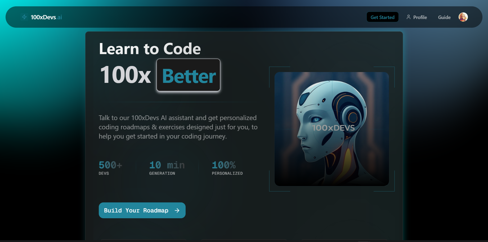

# 100xDevs.AI 

A powerful AI-powered Call assistant that assists users in learning and generating personalized learning paths based on their goals, skills, and preferences. Converse with the AI to get help with your learning and get a personalized learning path.

<div align="center">
    
</div>

## Features

- 🤖 AI-Powered Call Assistant
- 📊 Personalized Learning Paths
- 🎯 Goal-Oriented Planning
- ⏱️ Time Management
- 📚 Resource Curation

## Tech Stack

<div align="center">
    
    <br/>
    <br/>
    
</div>


- **Frontend**: Next.js, TypeScript, Tailwind CSS
- **Backend**: Convex
- **AI**: Google Gemini
- **Authentication**: Clerk
- **UI Components**: Shadcn UI
- **Icons**: Lucide Icons

## Getting Started

### Prerequisites

- Node.js (v18 or higher)
- npm or yarn
- Convex account
- Google Gemini API key
- Clerk account

### Installation

1. Clone the repository:
```bash
git clone https://github.com/yashksaini-coder/100xdevs-coder-trainer.git
cd 100xdevs-coder-trainer
```

2. Install dependencies:
```bash
npm install
# or
yarn install
```

3. Set up environment variables:
Create a `.env.local` file in the root directory with the following variables:
```env
NEXT_PUBLIC_CLERK_PUBLISHABLE_KEY=your_clerk_publishable_key
CLERK_SECRET_KEY=your_clerk_secret_key
GEMINI_API_KEY=your_gemini_api_key
NEXT_PUBLIC_CONVEX_URL=your_convex_url
```

4. Initialize Convex:
```bash
npx convex dev
```

5. Start the development server:
```bash
npm run dev
# or
yarn dev
```

## Project Structure

``` markdown

src/
├── app/                    # Next.js app directory
│   ├── profile/           # Profile page components
│   ├── generate-roadmap/  # Generate roadmap page components
│   ├── guide/             # Guide page components
│   └── ...                # Other pages
├── components/            # Reusable components
│   ├── ui/               # Shadcn UI components
│   └── ...               # Other components
├── convex/               # Backend functions
│   ├── http.ts          # HTTP endpoints
│   ├── roadmaps.ts      # Roadmap mutations/queries
│   ├── schema.ts        # Database schema
│   └── users.ts         # User-related functions
└── lib/                 # Utility functions
```

## API Endpoints

### Generate Roadmap
- **Endpoint**: `/vapi/generate-roadmap`
- **Method**: POST
- **Description**: Generates a personalized learning roadmap based on user input
- **Request Body**:
```json
{
  "Goal": "string",
  "Skill": "beginner | intermediate | advanced",
  "Time": "<2h | 2-5h | 5-10h | 10+h",
  "Interests": "string[]",
  "Deadline": "string",
  "Constraints": "string[]",
  "Preferences": "string[]",
  "Language": "string",
  "Status": "new | in_progress | completed",
  "user_id": "string"
}
```

## Roadmap Structure

Each roadmap includes:
- Learning goals
- Skill level assessment
- Time commitment
- Areas of interest
- Learning constraints
- Preferences
- Milestones
- Success metrics
- Estimated completion time

## Contributing

1. Fork the repository
2. Create your feature branch (`git checkout -b feature/amazing-feature`)
3. Commit your changes (`git commit -m 'Add some amazing feature'`)
4. Push to the branch (`git push origin feature/amazing-feature`)
5. Open a Pull Request

## Acknowledgments

- [Convex](https://convex.dev) for the backend infrastructure
- [Google Gemini](https://ai.google.dev) for AI capabilities
- [Clerk](https://clerk.com) for authentication
- [Shadcn UI](https://ui.shadcn.com) for UI components
- [Lucide Icons](https://lucide.dev) for icons

---

<a href="https://github.com/yashksaini-coder">
    <table>
        <tbody>
            <tr>
                <td align="left" valign="top" width="14.28%">
                    
                    <br/>
                    <h4 align="center">
                        <b>Yash K. Saini</b>
                    </h4>
                    <div align="center">
                        <p>(Author)</p>
                    </div>
                </td>
                <td align="left" valign="top" width="85%">
                    <p>
                        👋 Hi there! I'm <u><em><strong>Yash K. Saini</strong></em></u>, a self-taught software developer and a computer science student from India.
                    </p>
                    <ul>
                     <li>
                        I love building & contributing to Open Source software solutions & projects that help solve real-world problems.
                    </li>
                    <li>
                        I want to build products & systems that can benefit & solve problems for many other Developers.
                    </li>
                </td>
            </tr>
        </tbody>
    </table>
</a>

<p align="center">
    <strong>🌟 If you find this project helpful, please give it a star on GitHub! 🌟</strong>
</p>